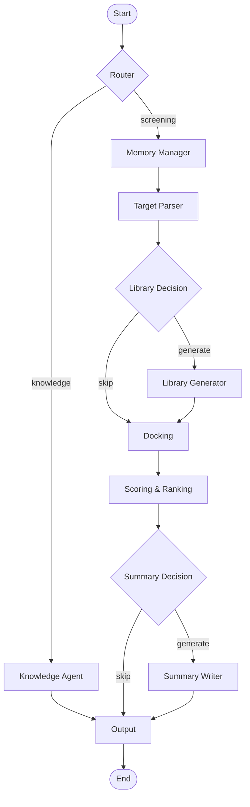

# Virtual Screening Orchestrator

## Overview
This project implements a multi-agent AI orchestrator for a mock virtual screening pipeline in drug discovery.
It demonstrates Agentic AI principles with modular agents, adaptive workflows, memory, and a knowledge agent.

## Features
- **Target Parser Agent** → Validates PDB IDs or maps protein names to mock PDB IDs.  
- **Library Generator Agent** → Generates molecular libraries (SMILES strings).  
- **Mock Docking Agent** → Assigns deterministic docking scores (-4.0 to -10.0).  
- **Scoring & Ranking Agent** → Ranks ligands by docking score, selects top 5 hits.  
- **Summary Writer Agent** → Generates a Markdown report.  
- **Knowledge Agent** → Answers chemistry/pharma questions from a local knowledge base.  
- **Memory Module** → Remembers last target & library size across sessions.  
- **Orchestrator** → Central controller that routes queries, adapts flows, and manages agents.

  
## How to Clone
```bash
git clone <your_repo_url>
cd VirtualScreening
```
Install dependencies:
```bash
pip install -r requirements.txt
```
## Usage

Run with a JSON query file:
```bash
    python orchestrator.py --query query.json
```

Use a single query for testing. Example queries are present in example_queries.json

## Outputs:

- **docking_results.csv** → All docking scores
- **top_hits.csv** → Ranked top 5 ligands
- **summary.md** → Human-readable Markdown summary

A seperate file for session memory is saved,
in this file last 5 sessions of the screening workflow are saved which makes it easier to get:
- **last_target**
- **last_library**

## Knowledge Base
The system answers basic drug discovery questions:
- **Lipinski’s Rule of 5**
- **ADMET**
- **Docking score**
- **Virtual screening overview**

these are stored in a knowledge_base.json file with definitions and importance

## Note
you must give a groq api key and paste it at start of the orchaestration.py code.

## KnowledgeAgent Future Extensions
- Currently the system is using keyword-based knowledge retreival.I want to enhance the system with semantic match using embedding-models (like sentence transformers).
- Another future extension would be implementing RAG (Retrieval Augmented Generation) for matching and retrieval.


## Workflow Diagram




